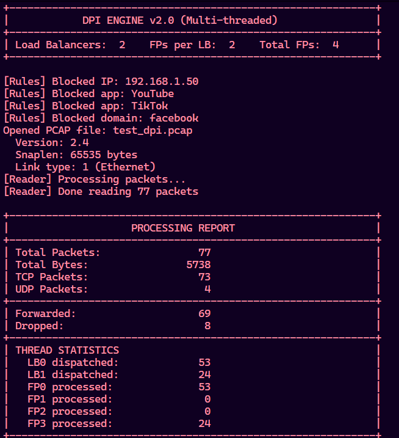
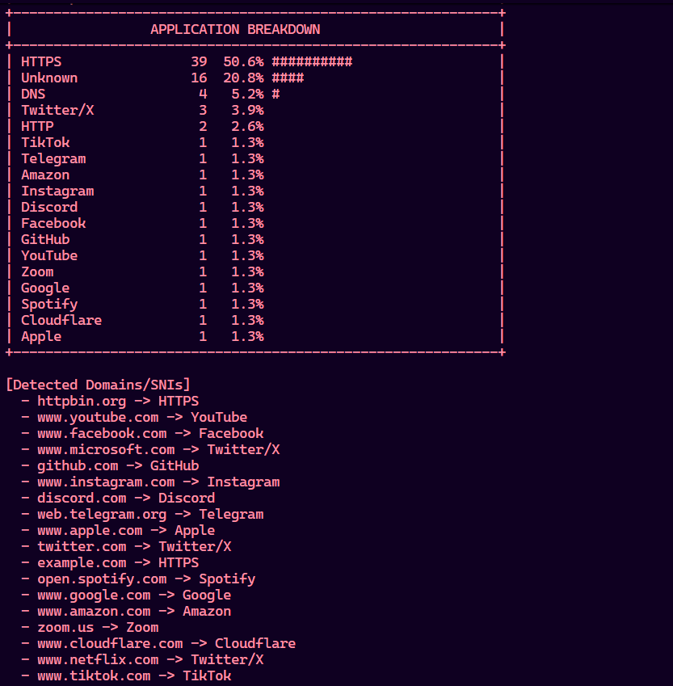

# DPI Engine — Deep Packet Inspection System

A high-performance multi-threaded Deep Packet Inspection (DPI) engine built in C++ for analyzing, classifying, and filtering network traffic from PCAP files.

The project performs:
- Packet parsing
- TLS SNI extraction
- Application classification
- Rule-based blocking
- Multi-threaded traffic processing
- Traffic statistics generation

---

# Features

- PCAP packet parsing
- TCP / UDP traffic analysis
- TLS SNI extraction
- Application detection
- Rule-based filtering
- Multi-threaded architecture
- Flow tracking using Five-Tuple
- Load balancing & fast-path processing
- Traffic statistics & reports
- Filtered output PCAP generation

---

# Supported Application Detection

- YouTube
- Facebook
- Instagram
- TikTok
- Google
- Twitter/X
- Netflix
- Spotify
- GitHub
- Discord
- Telegram
- Zoom
- Amazon
- Apple
- WhatsApp

---

# Project Structure

```text
Packet_analyzer/
│
├── include/                 # Header files
├── src/                     # Source files
├── test_dpi.pcap            # Sample traffic capture
├── output.pcap              # Filtered output
├── generate_test_pcap.py    # Test PCAP generator
├── CMakeLists.txt
└── README.md
```

---

# Architecture

```text
                 +----------------+
                 |  PCAP Reader   |
                 +--------+-------+
                          |
                          v
                +---------+---------+
                |   Load Balancer   |
                +----+---------+----+
                     |         |
             +-------+         +-------+
             |                         |
             v                         v
      +-------------+          +-------------+
      | Fast Path 0 |          | Fast Path 1 |
      +------+------+          +------+------+
             |                        |
             +-----------+------------+
                         |
                         v
                 +---------------+
                 | Output Writer |
                 +---------------+
```

---

# Build and Run

## Simple Version

```bash
g++ -std=c++17 -O2 -I include -o dpi_simple.exe \
src/main_working.cpp \
src/pcap_reader.cpp \
src/packet_parser.cpp \
src/sni_extractor.cpp \
src/types.cpp
```

## Multi-threaded Version

```bash
g++ -std=c++17 -pthread -O2 -I include -o dpi_engine.exe \
src/dpi_mt.cpp \
src/pcap_reader.cpp \
src/packet_parser.cpp \
src/sni_extractor.cpp \
src/types.cpp
```

# Run

## Basic Analysis

```bash
./dpi_engine.exe test_dpi.pcap output.pcap
```

## Block Applications & Domains

```bash
./dpi_engine.exe test_dpi.pcap output.pcap \
--block-app YouTube \
--block-app TikTok \
--block-domain facebook \
--block-ip 192.168.1.50
```

---

# Sample Output

## Processing Report



## Application Breakdown



---

# Technologies Used

- C++17
- Multi-threading (`std::thread`)
- PCAP Parsing
- Networking Protocols
- TLS / HTTPS Inspection
- Flow Hashing
- Producer–Consumer Queues

---

# Networking Concepts Implemented

- Deep Packet Inspection (DPI)
- Packet Parsing
- TCP/IP Protocol Analysis
- Flow Tracking
- TLS SNI Extraction
- Application Classification
- Load Balancing
- Concurrent Processing
- Rule-based Filtering

---

# Future Improvements

- Real-time packet capture
- HTTP/3 & QUIC support
- GUI dashboard
- Live traffic visualization
- Bandwidth throttling
- ML-based traffic classification

---

# Author

**Jatin Mallick**  
B.Tech IT Project — Deep Packet Inspection Engine